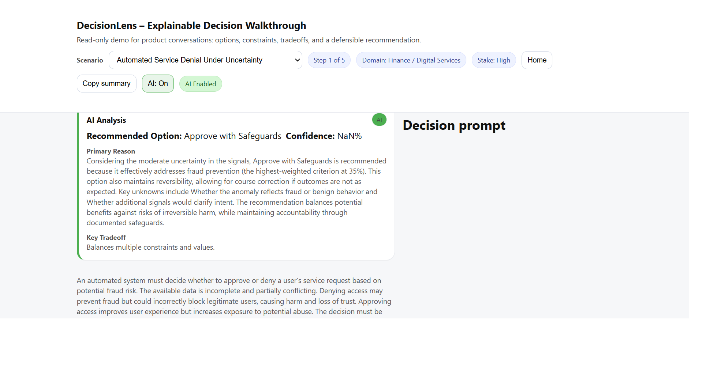
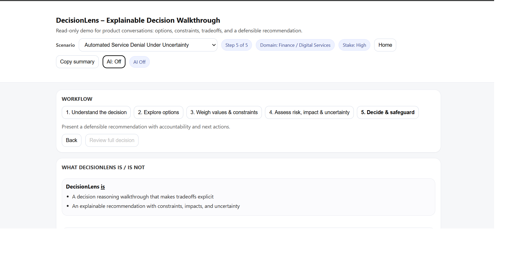

# DecisionLens

### Explainable AI for High-Stakes Decisions

  
  

DecisionLens is an **explainable decision-intelligence framework** designed to help teams evaluate complex decision scenarios involving competing priorities, constraints, and uncertainty.

Unlike traditional decision tools that produce opaque results, DecisionLens exposes the **reasoning behind recommendations**, allowing decision makers to understand *why* a particular option is preferred.

The goal is not to replace human judgment but to support **transparent, accountable decision-making**.

---

# Why This Project Matters

Artificial intelligence and automated systems are increasingly involved in decisions that affect people's lives:

• financial access  
• healthcare prioritization  
• AI deployment governance  
• risk and compliance decisions  

Many modern systems rely on **black-box machine learning models** that provide little visibility into how decisions are made.

This creates serious challenges for:

• regulatory compliance  
• organizational accountability  
• ethical decision-making  
• public trust  

DecisionLens demonstrates an alternative approach: **structured, explainable decision intelligence**.

Instead of hiding the reasoning process, DecisionLens makes it explicit:

• decision options are clearly defined  
• constraints and ethical limits are evaluated  
• tradeoffs are quantified  
• uncertainty is surfaced  
• recommendations are explained step-by-step  

The result is a system that supports **human oversight and defensible decision-making**, rather than replacing human judgment.

---

# Live Demo

Try the interactive demo:

👉 https://jleggett987.github.io/decisionlens-explainable-ai/

The demo includes:

• Interactive decision scenarios  
• Step-by-step decision walkthrough  
• Option comparison and scoring  
• Human impact analysis  
• Explainable recommendation reasoning  
• Optional AI-assisted analysis mode  

Users can explore how DecisionLens evaluates complex decisions and understand the reasoning behind recommendations.

---

## Technical Highlights

DecisionLens demonstrates several technical capabilities relevant to modern AI, product engineering, and decision-support systems.

**Explainable Decision Intelligence**

Implements a transparent decision engine that evaluates competing options using weighted multi-criteria scoring rather than opaque black-box models.

**Structured Scenario Modeling**

Complex decisions are modeled using structured scenario definitions including:

• options  
• constraints  
• competing values  
• evidence signals  
• uncertainty factors  
• human impact analysis  

This allows decisions to be evaluated systematically and reproducibly.

**Multi-Criteria Scoring Engine**

A deterministic scoring engine evaluates options across weighted value dimensions such as:

• risk mitigation  
• fairness  
• operational efficiency  
• trust and transparency  

Scores are aggregated to produce a defensible recommendation.

**Explainability Layer**

DecisionLens generates structured explanations including:

• primary reasoning  
• key tradeoffs  
• constraint validation  
• safeguard recommendations  

This ensures recommendations remain auditable and understandable.

**Interactive Decision Visualization**

The demo application provides a browser-based interface that allows users to:

• explore decision scenarios  
• compare option impacts  
• visualize scoring outcomes  
• walk through the reasoning process step-by-step

**Sensitivity Analysis**

The system can evaluate how sensitive recommendations are to changes in decision priorities, helping decision makers understand how robust a recommendation is under different assumptions.

**Optional AI-Assisted Analysis**

An AI-assisted mode can generate additional reasoning and analysis on top of the deterministic decision engine, allowing users to compare static and AI-generated recommendations.

---

### Technologies Used

• JavaScript (ES Modules)  
• Browser-based UI architecture  
• Structured decision modeling  
• Multi-criteria decision analysis (MCDA)  
• Explainable AI design principles  
# The Problem

Organizations face complex decisions every day:

• Deploying AI systems responsibly  
• Choosing technology platforms  
• Evaluating vendors and risk exposure  
• Balancing cost, safety, fairness, and performance  

Many AI systems produce **black-box outputs** that cannot easily be explained or audited.

In regulated or high-risk environments, that lack of transparency becomes a serious problem.

DecisionLens focuses on **structured, explainable reasoning rather than opaque optimization**.

---

# Decision Workflow

### How DecisionLens Works

DecisionLens models decisions as a structured reasoning process:

1. Define the decision scenario  
2. Enumerate possible options  
3. Identify constraints and priorities  
4. Evaluate tradeoffs and uncertainty  
5. Generate a transparent recommendation  

Each recommendation includes:

• Primary reasoning  
• Key tradeoffs  
• Constraint validation  
• Human impact analysis  
• Uncertainty assessment  
• Confidence level  

This allows decision makers to see not just **what decision is recommended**, but **why it was recommended**.

---

# Example Output

Recommended Option: Controlled AI Deployment
Confidence Score: 81%

Primary Reason:
Balances innovation velocity with governance safeguards.

Key Tradeoff:
Introduces operational oversight to reduce uncontrolled risk exposure.

Safeguards:
• staged deployment
• monitoring thresholds
• review checkpoints

DecisionLens focuses on making **the reasoning visible**, not just the final outcome.

---

# Example Scenarios

The repository currently includes several structured decision scenarios:

### AI Deployment Governance

Evaluates how organizations can deploy AI systems responsibly while maintaining innovation velocity and regulatory compliance.

### Fraud Detection Access Control

Balances fraud prevention with user access fairness in real-time digital services.

### Healthcare Resource Allocation

Explores how hospitals might allocate limited critical-care resources while balancing survival probability, fairness, and operational feasibility.

These scenarios demonstrate how DecisionLens analyzes **complex tradeoffs across domains**.

---

# Explainability Report Output

DecisionLens produces a structured reasoning report explaining how a recommendation was derived.

Example report output:

Decision Scenario: Fraud Detection Access Control

Options Evaluated
────────────────────────

A: Approve Request
B: Deny Request
C: Approve with Safeguards

Scoring Results
────────────────────────

Option A
Fraud Prevention: 40
Fairness: 85
Trust: 70
Efficiency: 90
Overall Score: 67

Option B
Fraud Prevention: 85
Fairness: 30
Trust: 45
Efficiency: 80
Overall Score: 61

Option C
Fraud Prevention: 70
Fairness: 75
Trust: 75
Efficiency: 65
Overall Score: 72

Recommendation
────────────────────────

Recommended Option: C
Confidence: Medium

Primary Reason
Balances fraud prevention with fairness under uncertainty.

Key Tradeoff
Accepts operational cost to reduce the risk of unjust denial.

Safeguards
────────────────────────

• Trigger manual review for flagged cases
• Monitor post-approval behavior
• Collect additional signals to reduce uncertainty
• Re-evaluate thresholds if false positives increase

---

# Sensitivity Analysis

DecisionLens also supports **sensitivity analysis**, which evaluates how stable a recommendation is when decision priorities change.

Example:

Current Recommendation: Option C

If Fraud Prevention weight increases 10%
→ Option B becomes best

If Fairness weight increases 10%
→ Option A becomes best

If Trust weight increases 10%
→ Recommendation remains Option C

This helps decision makers understand **how robust a recommendation is under different assumptions**.

---

# System Architecture

Scenario Data
↓
Decision Engine
↓
Multi-Criteria Scoring
↓
Tradeoff Analysis
↓
Explanation Generator
↓
Recommendation Output

This design ensures that decisions remain **auditable, explainable, and defensible**.

---

# Repository Structure

scenarios.js
Structured decision scenarios used by the demo

app.js
Application routing and workflow logic

render.js
UI rendering and explainability visualization

scoring-engine.js
Multi-criteria decision scoring engine

explanation-generator.js
Natural-language explanation generation

ai-service.js
AI-assisted analysis and recommendation engine

Decision_Schema.md
Core decision modeling framework

---

# Key Principles

DecisionLens is built around several core principles.

### Explainability

Recommendations must be understandable and auditable.

### Constraint Awareness

Hard constraints and ethical limits are evaluated before scoring options.

### Tradeoff Transparency

Competing values and impacts are explicitly surfaced.

### Human Accountability

The system supports human decision makers rather than replacing them.

---

# Vision

DecisionLens aims to become a framework for **transparent AI-assisted decision systems** used in domains such as:

• AI governance  
• regulatory compliance  
• healthcare decision support  
• financial risk management  
• technology strategy and procurement  

As AI systems increasingly influence high-stakes decisions, tools like DecisionLens help ensure those decisions remain **explainable and accountable**.

---

# Author

Jason Leggett  
Senior Software Engineer / Engineering Lead  

LinkedIn  
https://linkedin.com/in/jasonleggett

---

# License

MIT License

